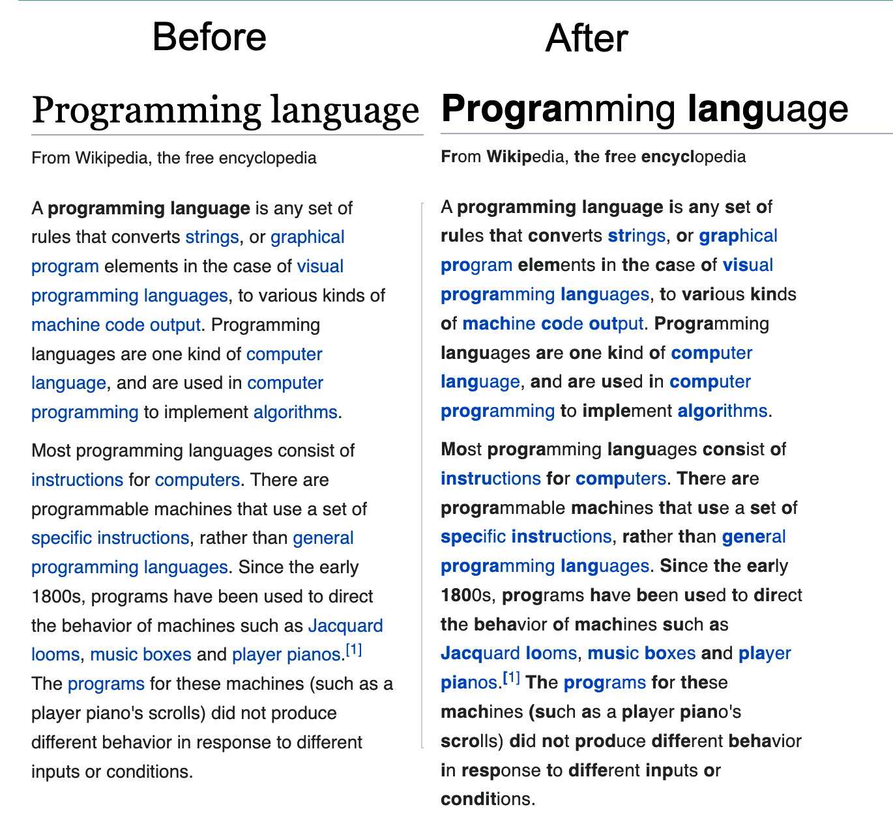

# Original Idea
https://bionic-reading.com/

Until they finish the extension, here's bookmarklet to do the same

# Installation

Go to https://dbuezas.github.io/biotic-text/ and drag&drop the link to the bookmark bar

# Implementation details

* Goookmarklet generated with: https://caiorss.github.io/bookmarklet-maker/
* Works replacing all text node with a pair of wrapped text nodes, the first bold, the second one light.